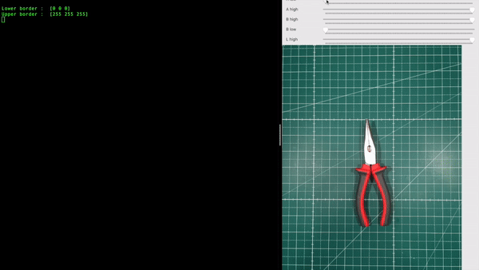

# Color space range selector

This simple tool helps you to find threshold values for the color filtering in different color spaces. Currently support following color spaces `lab`, `rgb`, `hsv`. 

# Dependency

To run, you need:
- python3 interpreter
- opencv lib

To install `opencv` execute the following command `pip3 install -r requirements.txt`

# Run

To start program, run from the terminal: 

`python3 color_range_selector.py <color_space {lab, rgb, hsv}> <filename>`

An example:

`python3 color_range_selector.py lab image.jpg`

Selected threshold values are visible in the terminal.

To stop and quit, press ESC button.